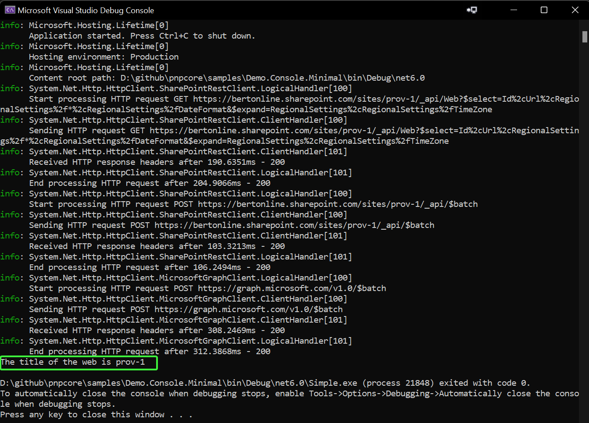

# PnP Core SDK - Minimal getting started sample

This solution aims at showing you how you can use PnP Core SDK using the minimal amount of configuration and code.

## Source code

You can find the sample source code here: [/samples/Demo.Console.Minimal](https://github.com/pnp/pnpcore/tree/dev/samples/Demo.Console.Minimal)

> [!Note]
> This sample was created with [Visual Studio 2022](https://visualstudio.microsoft.com/vs/) using [.NET 6.0](https://dotnet.microsoft.com/).

## Sample configuration

### Create an Azure AD application

The one thing to configure before you can use this sample is an Azure AD application:

1. Navigate to https://aad.portal.azure.com
2. Click on **Azure Active Directory**, followed by navigating to **App registrations**
3. Add a new application via the **New registration** link
4. Give your application a name, e.g. PnPCoreSDKConsoleDemo and add **http://localhost** as redirect URI. Clicking on **Register** will create the application and open it
5. Take note of the **Application (client) ID** value, you'll need it in the next step
6. Click on **API permissions** and add these **delegated** permissions
   1. Microsoft Graph -> Sites.Manage.All
   2. SharePoint -> AllSites.Manage
7. Consent the application permissions by clicking on **Grant admin consent**

### Configure the application

Open **Program.cs** and update the value assigned to the `clientId` and `siteUrl` variables to the created Azure AD client id and valid site URL for your tenant.

```csharp
using Microsoft.Extensions.DependencyInjection;
using Microsoft.Extensions.Hosting;
using PnP.Core.Auth;
using PnP.Core.Services;

string clientId = "c6b15c83-d569-4514-b4af-d433110123de";
string siteUrl = "https://bertonline.sharepoint.com/sites/prov-1";

// Creates and configures the host
var host = Host.CreateDefaultBuilder()
    .ConfigureServices((context, services) => 
    {
        // Add PnP Core SDK
        services.AddPnPCore(options =>
        {
            // Configure the interactive authentication provider as default
            options.DefaultAuthenticationProvider = new InteractiveAuthenticationProvider()
            {
                ClientId = clientId,
                RedirectUri = new Uri("http://localhost")
            };
        });
    })
    .UseConsoleLifetime()
    .Build();

// Start the host
await host.StartAsync();

using (var scope = host.Services.CreateScope())
{
    // Ask an IPnPContextFactory from the host
    var pnpContextFactory = scope.ServiceProvider.GetRequiredService<IPnPContextFactory>();

    // Create a PnPContext
    using (var context = await pnpContextFactory.CreateAsync(new Uri(siteUrl)))
    {
        // Load the Title property of the site's root web
        await context.Web.LoadAsync(p => p.Title);
        Console.WriteLine($"The title of the web is {context.Web.Title}");
    }
}
```

## Run the sample

Press **F5** to launch the sample. A new browser window/tab will open asking you to authenticate with your Microsoft 365 account. Once you've done that the application will get the title of the site and display it.


