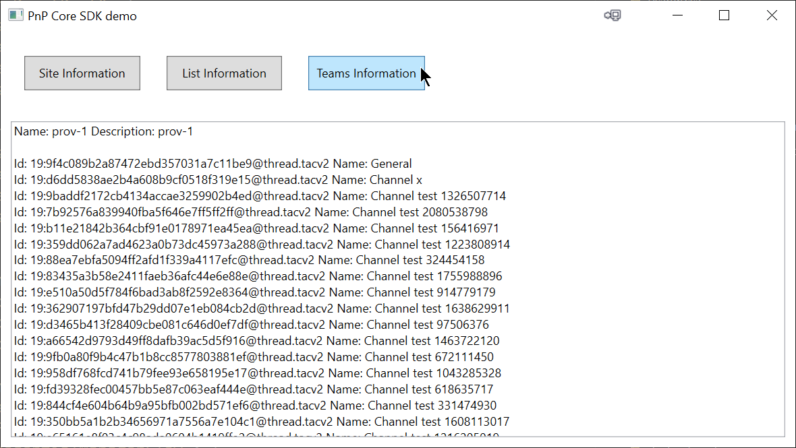

# PnP Core SDK - WPF Sample

This solution demonstrates how the PnP Core SDK can be used in a WPF application

## Source code

You can find the sample source code here: [/samples/Demo.WPF](https://github.com/pnp/pnpcore/tree/dev/samples/Demo.WPF)

# Run the sample

## Register and configure an AAD app

In order for the user to authenticate on the App, A new app registration should be created on Azure Portal

- Go to [Azure Active Directory Portal](https://aad.portal.azure.com)

- In App registrations, click __New registration__

- Enter a name for your new app, make sure *Accounts in this organizational directory only* is selected. As the Redirect URI, in Web platform enter __http://localhost__ (only needed if you want use an interactive authentication flow)

- Under __Implicit grant__ section, check __ID tokens__ and __Access tokens__

- Under __Advanced settings__ section, set __Allow public client flows__ to __yes__

- Go to __API permissions__ section , click __Add a permission__
  - Select __Microsoft Graph__ > __Delegated permissions__ > select __Directory.Read.All__
  - Select __Microsoft Graph__ > __Delegated permissions__ > select __User.Read__
  - Select __Microsoft Graph__ > __Delegated permissions__ > select __ChannelMessage.Read.All__
  - Select __Microsoft Graph__ > __Delegated permissions__ > select __ChannelMessage.Send__
  - Select __Microsoft Graph__ > __Delegated permissions__ > select __TeamSettings.ReadWrite.All__
  - Select __Microsoft Graph__ > __Delegated permissions__ > select __TeamsTab.ReadWrite.All__

- Click __Grand admin consent for {tenant}__

- From __Overview__,
-- copy the value of __Directory (tenant) ID__
-- copy the value of __Application (client) ID__

## Configure your application

The application can be used with different authentication providers, see https://pnp.github.io/pnpcore/articles/consumer/configuring%20authentication.html for more details on the options.

In this the sample uses an interactive flow, so you need to:

- Configure the Tenant ID of your app as the value of `PnPCore:Credentials:InteractiveFlow:TenantId` in appsettings.json setting
- Configure the Client ID of your app as the value of `PnPCore:Credentials:InteractiveFlow:ClientId` in appsettings.json setting
- Configure the URL of a target Microsoft SharePoint Online modern team site collection as the value of `PnPCore:Credentials:Sites:DemoSite:SiteUrl` in appsettings.json setting

Be sure to have a Team in Microsoft Teams backing the modern team site in the above site collection

## Execute

  Hit F5 in Visual studio to execute the WPF app.
  When clicking on one of the buttons to load data, the applications prompts you for signing in via your browser.

  
