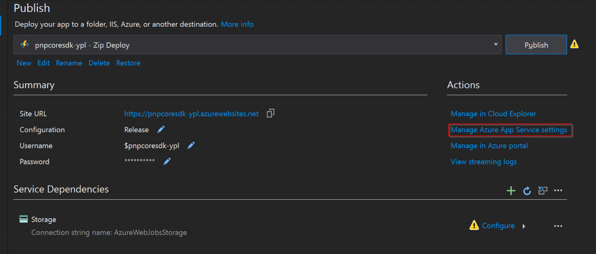
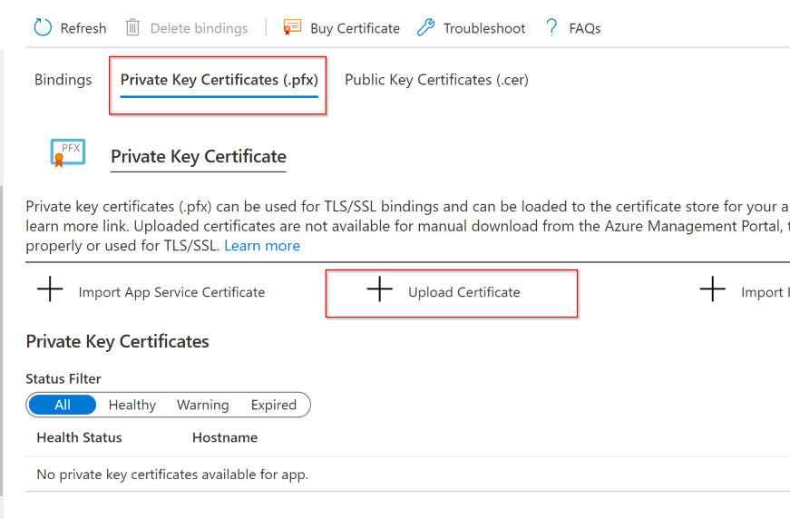
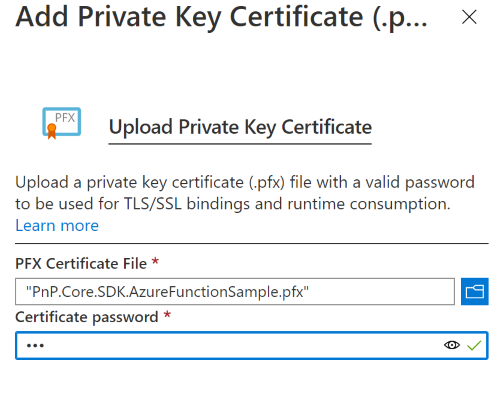
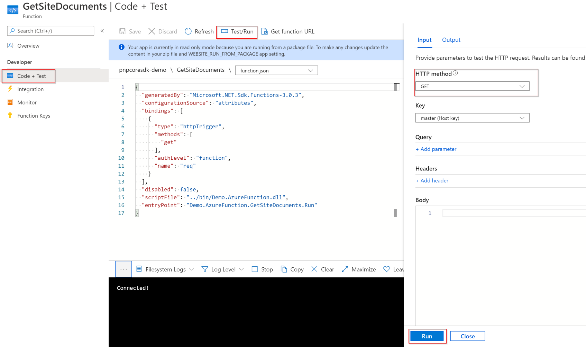

# PnP Core SDK - Azure Function v3 Sample

This solution demonstrates how to build a simple backend API in the form of an HTTP Trigger Azure Function 
 - A GetSiteDocuments() function that returns the list of documents in the Shared Documents library of the configured site.
  it uses an App-Only context authenticated with a self signed certificate

> **Note**
> this sample was created with Visual Studio 2019 (v16.7.3) and has been tested with a Windows Azure Function v3.
>

## Source code

You can find the sample source code here: [/src/samples/Demo.AzureFunction](https://github.com/pnp/pnpcore/tree/dev/src/samples/Demo.AzureFunction)

## Quickstart

### Setup

> **Note**
> For the quickstart setup, you will need to have a recent version (> 3.24) of PnP PowerShell installed on your machine.
>

From the solution folder execute the following PowerShell.
(Make sure you set the values of the variables according to your environment and preferences)

```PowerShell
$site = "https://contoso.sharepoint.com/sites/pnpcoresdktestgroup"
$tenant = "contoso.onmicrosoft.com"
$pwd = "pwd"
.\Configure.ps1 -SiteUrl $site -Tenant $pwd -CertificatePassword $pwd
```

This script will:
 - register a new Azure AD application
 - grant it the permissions to allow the use of all PnP Core SDK features
 - Create a self signed certificate, save it to your local store and export it as .cer and .pfx files
 - Pre-fill your local.settings.json file with the needed information from operations above

Feel free to have a look at the Configure.ps1 to check what it does.

The settings of the Azure Function will contain the following

```json
{
  "IsEncrypted": false,
  "Values": {
    "AzureWebJobsStorage": "UseDevelopmentStorage=true",
    "FUNCTIONS_WORKER_RUNTIME": "dotnet",

    "SiteUrl": "https://contoso.sharepoint.com/sites/pnpcoresdktestgroup",
    "TenantId": "[TENANT ID]",
    "ClientId": "[CLIENT ID]",
    "CertificateThumbPrint": "[CERTIFICATE THUMBPRINT]",
    "WEBSITE_LOAD_CERTIFICATES": "[CERTIFICATE THUMBPRINT]"
  }
}
```

The settings above are mostly necessary for authentication.

| Setting                   | Description
|---------------------------|---------------------------------------
| SiteUrl                   | This parameter allows you to configure the URL of the Site to use for your Default configuration.
| TenantId                  | The ID (GUID) of your tenant. Used by the PnP Core authentication provider.
| ClientId                  | The Client ID of your Azure AD app. Used by the PnP Core authentication provider.
| CertificateThumbPrint     | The Thumbprint of the certificate. Used by the PnP Core authentication provider.
| WEBSITE_LOAD_CERTIFICATES | The Thumbprint of the certificate. Indicates the Azure Function runtime to load the certificate from its registered certificates.

> **Note**
> For more information about configuring authentication, please visit https://github.com/pnp/pnpcore/blob/dev/docs/articles/consumer/configuring%20authentication.md#application-permissions-acting-as-an-app-account-with-app-only-permissions
>

### Try it locally

Open the solution in Visual Studio and hit F5 to launch the Azure Function emulator

When you see the following your local Azure Function is up and running
```console
Azure Functions Core Tools (3.0.2912 Commit hash: bfcbbe48ed6fdacdf9b309261ecc8093df3b83f2)
Function Runtime Version: 3.0.14287.0
Hosting environment: Production
Content root path: C:\wrk\pnp\pnpcore\src\samples\Demo.AzureFunction\bin\Debug\netcoreapp3.1
Now listening on: http://0.0.0.0:7071
Application started. Press Ctrl+C to shut down.

Functions:

        GetSiteDocuments: [GET] http://localhost:7071/api/GetSiteDocuments
```

To test the API, you can open the above URL in a browser
or by typing the following command in a console:

```console
curl http://localhost:7071/api/GetSiteDocuments
```

## Try it on Azure

If you followed all the steps above and the Function is working well locally, you can publish your Azure Function on Azure.
For the sake of simplicity, in this sample, we will use the **Publish** feature from Visual Studio.

The extra steps consist in:
- Make sure the app settings are specified in the Azure Function App
- Make sure the Certificate we use for authentication is uploaded to the Azure Function App

To publish the Azure Function:
- In the Visual Studio Solution Explorer, right-click the **Demo.AzureFunction** project and click **Publish**
- Create or Import a publishing profile to an Azure Function App
- Click **Publish**
- Click the **Manage Azure App Service settings** link



- For each setting for which a Remote value is not yet specified, click the **Insert value from Local** link


- Click the **Manage in Azure Portal** link
- In the **TLS/SSL settings** tab, choose **Private Key Certificates (.pfx)** and click **Upload Certificate**





- Browse your computer and select the .pfx certificate we created earlier, enter the password chosen earlier and click **Upload**

To Make sure the Azure Function is working properly, 
On the Azure Portal, on your Function App blade:
 - Go to the **Functions** tab
 - Select the **GetSiteDocuments** function
 - On the **Code + Test** tab, click the **Test/Run** button
 - Make sure the chosen **Method** is **GET**
 - Click **Run**




 Alternatively, from **Code + Test** tab mentioned aboved you can click the **Get Function URL** button and copy the URL.
 Then paste it in your browser or using curl in a terminal (see example here below)

 ```console
 # On Windows 10
 curl https://pnpcoresdk-demo.azurewebsites.net/api/GetSiteDocuments?code=gqyZ4H259HbYfk7axxxxxxxxxxxxxxxaqmtleLUHISazg/FDvSbLtYaw==

 StatusCode        : 200
StatusDescription : OK
Content           : {"documents":[{"name":"test.docx","timeLastModified":"2020-08-31T21:29:56Z","uniqueId":"fbc3c372-c1
                    36-45ee-8341-1e768c973182"}]}
RawContent        : HTTP/1.1 200 OK
                    Content-Length: 128
                    Content-Type: application/json; charset=utf-8
                    Date: Sun, 27 Sep 2020 15:52:36 GMT

                    {"documents":[{"name":"test.docx","timeLastModified":"2020-08-31T21:29:56Z",...
Forms             : {}
Headers           : {[Content-Length, 128], [Content-Type, application/json; charset=utf-8], [Date, Sun, 27 Sep 2020
                    15:52:36 GMT]}
Images            : {}
InputFields       : {}
Links             : {}
ParsedHtml        : mshtml.HTMLDocumentClass
RawContentLength  : 128
 ```
